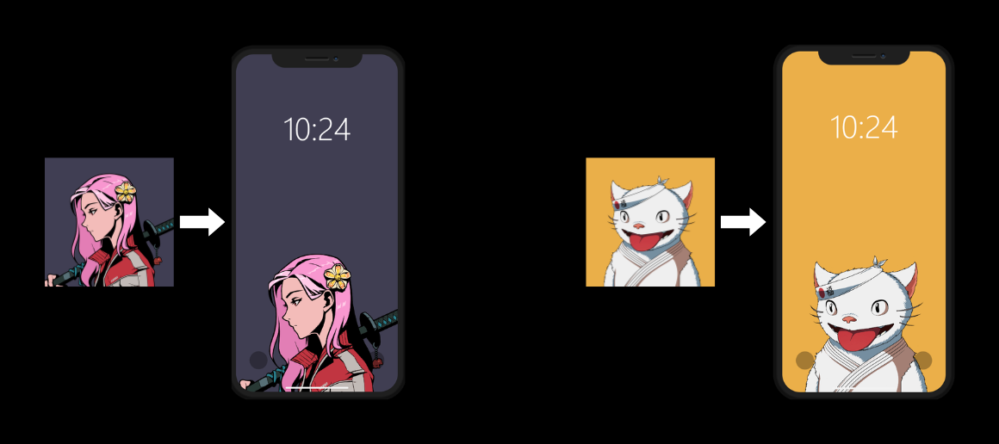

# Meta Kabegami - NFT Wallpaper Generator


Meta Kabegami is a tool that allows you to generate wallpapers from your favorite NFTs. By providing the URL of an NFT on OpenSea, you can easily create a personalized wallpaper. Due to OpenSea access limitations, this tool needs to be downloaded and run locally on your machine.

## Features

- Generate wallpapers from NFTs listed on OpenSea.
- Easy-to-use interface: just copy the NFT's URL and paste it into the field.
- Opt to send wallpapers by email or download files locally.
- Download and run the program locally.


## Requirements

- Python 3.7 or higher
- Internet connection to fetch NFT data from OpenSea

## Installation

1. **Clone the Repository:**

    ```bash
    git clone https://github.com/yourusername/meta-kabegami.git
    cd meta-kabegami
    ```

2. **Create a Virtual Environment:**

    ```bash
    python -m venv env
    ```

3. **Activate the Virtual Environment:**

    - **Windows:**

      ```bash
      .\env\Scripts\activate
      ```

    - **macOS/Linux:**

      ```bash
      source env/bin/activate
      ```

4. **Install Dependencies:**

    ```bash
    pip install -r requirements.txt
    ```

5. **Create a `.env` File:**

    In the root directory of the project, create a file named `.env` and add the following line:

    ```plaintext
    SECRET_KEY=your_secret_key
   EMAIL=your_email@example.com
   PASSWORD=your_email_password_or_app_password (For Gmail, an App Password is required)
   TO_EMAIL=recipient_email@example.com
    ```

    Replace `your_secret_key` with a strong, unique key.

## Usage

1. **Run the Program:**

    ```bash
    python main.py
    ```

2. **Generate Wallpaper:**
    - Go to the specific page of the NFT on OpenSea.
    - Copy the URL of the NFT.
    - Paste the URL into the field provided in the program.
    - Follow the on-screen instructions to generate and download your wallpaper.

## Example

1. Navigate to your favorite NFT on OpenSea.
2. Copy the URL of the NFT (e.g., `https://opensea.io/assets/ethereum/0x.../1234`).
3. Run the program and paste the URL when prompted.
4. Download or email your personalized NFT wallpaper.

## Contributing

Contributions are welcome! Please fork the repository and submit pull requests.

1. Fork the Project
2. Create your Feature Branch (`git checkout -b feature/AmazingFeature`)
3. Commit your Changes (`git commit -m 'Add some AmazingFeature'`)
4. Push to the Branch (`git push origin feature/AmazingFeature`)
5. Open a Pull Request
